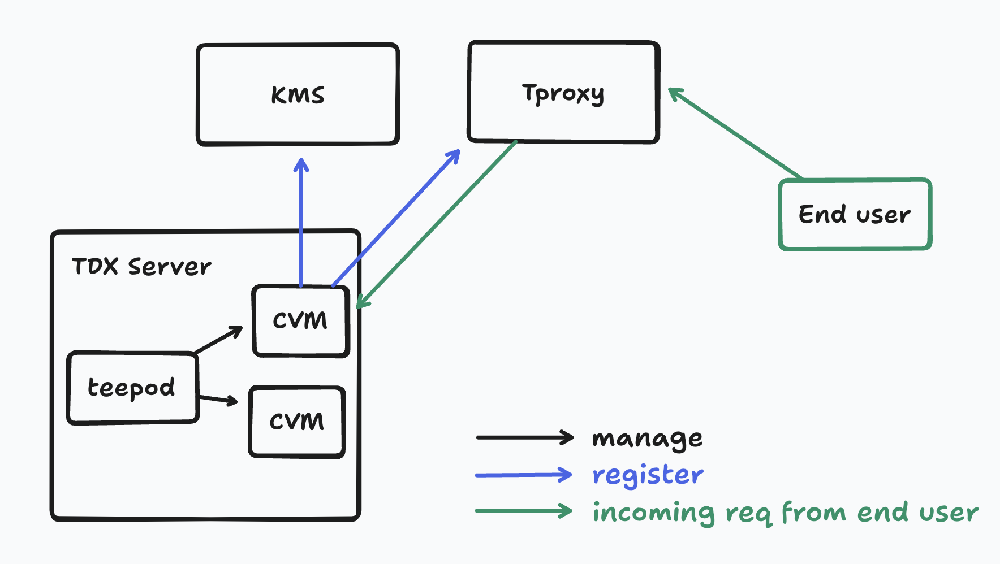
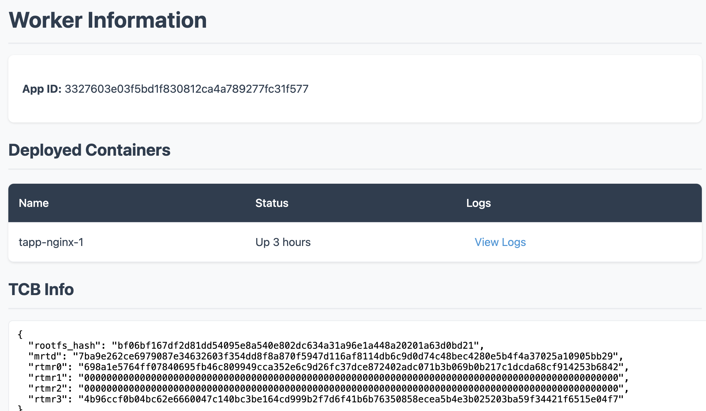
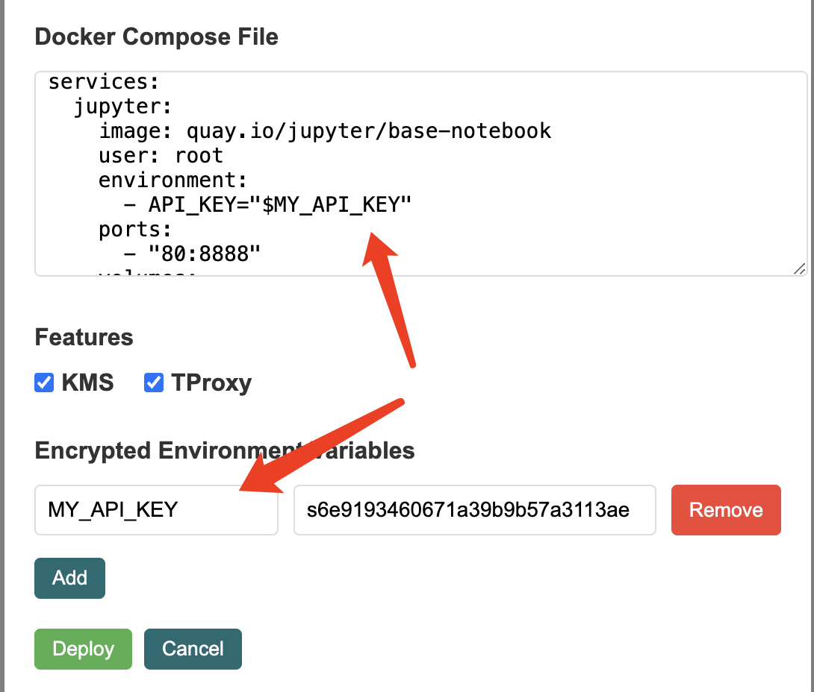
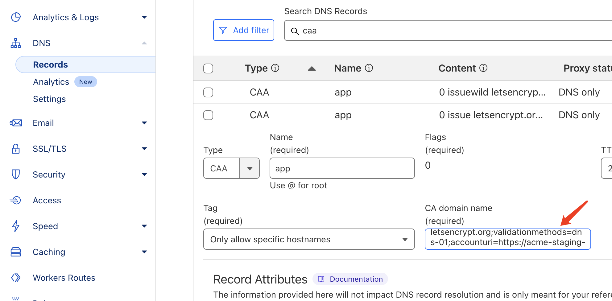
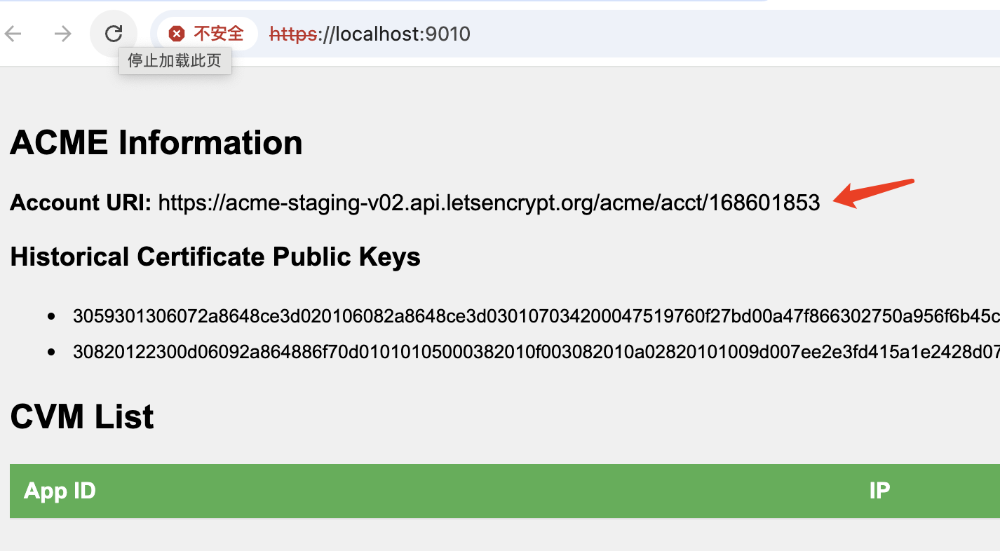

# Dstack

[](https://deepwiki.com/Dstack-TEE/dstack)

Dstack is a **developer friendly** and **security first** SDK to simplify the deployment of arbitrary containerized apps into TEE.

Main features:

- 🔒 Deploy containerized apps securely in TEE in minutes
- 🛠️ Use familiar tools - just write a docker-compose.yaml
- 🔑 Safely manage secrets and sensitive data
- 📡 Expose services via built-in TLS termination

Dstack is community driven. Open sourced and built by [Kevin Wang](https://github.com/kvinwang) and many others from [Phala Network](https://github.com/Phala-Network), inspired by [Andrew Miller](https://github.com/amiller) (Flashbots & Teleport), and contributed by [Nethermind](https://github.com/NethermindEth/nethermind) and [many others](#contributors).


# Overview

Components in Dstack:

- `dstack-vmm`: A service running in bare TDX host to manage CVMs
- `dstack-gateway`: A reverse proxy to forward TLS connections to CVMs
- `dstack-kms`: A KMS server to generate keys for CVMs
- `dstack-guest-agent`: A service running in CVM to serve containers' key derivation and attestation requests
- `meta-dstack`: A Yocto meta layer to build CVM guest images

The overall architecture is shown below:


# Directory structure

```text
dstack/
    kms/                         A prototype KMS server
    guest-agent/                 A service running in CVM to serve containers' key derivation and attestation requests.
    dstack-util/                 A CLI tool in the guest setting up the system, getting TDX quote, extending RTMR, generating cert for RA-TLS, etc.
    vmm/                         A service running in bare TDX host to manage CVMs
    gateway/                     A reverse proxy to forward TLS connections to CVMs
    certbot/                     A tool to automatically obtain and renew TLS certificates for dstack-gateway
    ra-rpc/                      RA-TLS support for pRPC
    ra-tls/                      RA-TLS support library
    tdx-attest/                  Guest library for getting TDX quote and extending RTMR
```

# Build and play locally

## Prerequisites

- A bare metal TDX server setup following [canonical/tdx](https://github.com/canonical/tdx)
- Public IPv4 address assigned to the machine
- At least 16GB RAM, 100GB free disk space.
- A domain with DNS access if you want to set up `dstack-gateway` for Zero Trust HTTPS

> [!NOTE]
>
> This doc assumes you have access to a compatible Intel TDX Server ready to be configured with Dstack. Check the [Hardware Requirements](https://docs.phala.network/dstack/hardware-requirements) for more information on buying a bare metal server or renting a server from OVH. To start learning about Dstack check out the [docs](https://docs.phala.network/dstack/overview).
>
> If you are looking to deploy a CVM in minutes, go to the docs to learn how to [sign-up for a Phala Cloud Account](https://docs.phala.network/phala-cloud/getting-started/sign-up-for-cloud-account) and [deploy your first CVM on Dstack]((https://docs.phala.network/phala-cloud/getting-started/start-from-cloud-ui)).

## Install dependencies

```bash
# for Ubuntu 24.04
sudo apt install -y build-essential chrpath diffstat lz4 wireguard-tools xorriso
# install rust
curl --proto '=https' --tlsv1.2 -sSf https://sh.rustup.rs | sh
```

## Build and run for local development

### Build the artifacts
```bash
git clone https://github.com/Dstack-TEE/meta-dstack.git --recursive
cd meta-dstack/

mkdir build
cd build
../build.sh hostcfg
# This outputs the following message:
# Config file ../build-config.sh created, please edit it to configure the build

vim ./build-config.sh
```

Review and customize the `build-config.sh` configuration file according to your environment requirements. The file contains network ports, domain settings, and other important parameters. Once configured, run the build script again to generate the necessary artifacts:

```bash
../build.sh hostcfg

# If everything is okay, you should see the built artifacts in the `build` directory.
$ ls
certs  images  dstack-kms  kms.toml  run  dstack-vmm  vmm.toml  dstack-gateway  gateway.toml
```

### Download guest image or build guest image from source

```bash
# This will download the guest image from the release page.
../build.sh dl 0.5.2
```

Or build guest image from source:

```bash
# This will build the guest image from source using the yocto meta layer. This will take a while.
../build.sh guest
```

> **Note on Reproducible Builds**: The build command above does not guarantee reproducibility. For reproducible builds across different build environments, please refer to the [reproducible build instructions](https://github.com/Dstack-TEE/meta-dstack?tab=readme-ov-file#reproducible-build-the-guest-image) in the meta-dstack repository.

### Run components
Now you can open 3 terminals to start the components:

1. Run `./dstack-kms -c kms.toml`
2. Run `sudo ./dstack-gateway -c gateway.toml`
3. Run `./dstack-vmm -c vmm.toml`

⚠️ *Warning: this is for local development, and the kms is not secure, so you should not use it in production.*
For production, you should follow the [deployment guide](./docs/deployment.md) and read the [security guide](./docs/security-guide/security-guide.md).

## Deploy an App
Open the dstack-vmm webpage [http://localhost:9080](http://localhost:9080)(change the port according to your configuration) on your local machine to deploy a `docker-compose.yaml` file:


After the container deployed, it should need some time to start the CVM and the containers. Time would be vary depending on your workload.

- Click the [Logs] button to see the logs of the CVM, you can see if the container is finished starting there.

- Once the container is running, you can click the [Dashboard] button to see some information of the container. And the logs of the containers can be seen in the [Dashboard] page.

    

- You can open dstack-gateway's dashboard at [https://localhost:9070](https://localhost:9070) to see the CVM's wireguard ip address, as shown below:


## Pass Secrets to Apps
When deploying a new App, you can pass private data via Encrypted Environment Variables. These variables can be referenced in the docker-compose.yaml file as shown below:



The environment variables will be encrypted in the client-side and decrypted in the CVM before being passed to the containers.

## Access the App

Once the app is deployed and listening on an HTTP port, you can access the HTTP service via dstack-gateway's public domain. The ingress mapping rules are:

- `<id>[s].<base_domain>` maps to port `80` or `443` if with `s` in the CVM.
- `<id>-<port>[s].<base_domain>` maps to port `<port>` in the CVM.

For example, `3327603e03f5bd1f830812ca4a789277fc31f577-8080.app.kvin.wang` maps to port `8080` in the CVM.

Where the `<id>` can be either the app id or the instance id. If the app id is used, one of the instances will be selected by the load balancer.
If the `id-port` part ends with `s`, it means the TLS connection will be passthrough to the app rather than terminating at dstack-gateway.

You can also ssh into the CVM to inspect more information, if your deployment uses the image `dstack-x.x.x-dev`:

```bash
# The IP address of the CVM can be found in the dstack-gateway dashboard.
ssh root@10.0.3.2
```

## Getting TDX quote in docker container

To get a TDX quote within app containers:

1. Mount `/var/run/dstack.sock` to the target container in `docker-compose.yaml`

    ```yaml
    version: '3'
    services:
    nginx:
        image: nginx:latest
        volumes:
        - /var/run/dstack.sock:/var/run/dstack.sock
        ports:
        - "8080:80"
        restart: always
    ```

2. Execute the quote request command in the container.

    ```bash
    # The argument report_data accepts binary data encoding in hex string.
    # The actual report_data passing the to the underlying TDX driver is sha2_256(report_data).
    curl --unix-socket /var/run/dstack.sock http://localhost/GetQuote?report_data=0x1234deadbeef | jq .  
    ```

## Container logs

Container logs can be obtained from the CVM's `dashboard` page or by curl:

```bash
curl 'http://<appid>.app.kvin.wang:9090/logs/<container name>?since=0&until=0&follow=true&text=true&timestamps=true&bare=true'
```

Replace `<appid>` and `<container name>` with actual values. Available parameters:

- since=0: Starting Unix timestamp for log retrieval
- until=0: Ending Unix timestamp for log retrieval
- follow: Enables continuous log streaming
- text: Returns human-readable text instead of base64 encoding
- timestamps: Adds timestamps to each log line
- bare: Returns the raw log lines without json format

The response of the RPC looks like:
```
$ curl 'http://0.0.0.0:9190/logs/zk-provider-server?text&timestamps'
{"channel":"stdout","message":"2024-09-29T03:05:45.209507046Z Initializing Rust backend...\n"}
{"channel":"stdout","message":"2024-09-29T03:05:45.209543047Z Calling Rust function: init\n"}
{"channel":"stdout","message":"2024-09-29T03:05:45.209544957Z [2024-09-29T03:05:44Z INFO  rust_prover] Initializing...\n"}
{"channel":"stdout","message":"2024-09-29T03:05:45.209546381Z [2024-09-29T03:05:44Z INFO  rust_prover::groth16] Starting setup process\n"}
```

## TLS Passthrough with Custom Domain

dstack-gateway supports TLS passthrough for custom domains.

See the example [here](https://github.com/Dstack-TEE/dstack-examples/tree/main/custom-domain/dstack-ingress) for more details.

## Upgrade an App

Got to the dstack-vmm webpage, click the [Upgrade] button, select or paste the compose file you want to upgrade to, and click the [Upgrade] button again.
The app id does not change after the upgrade. Stop and start the app to apply the upgrade.

## HTTPS Certificate Transparency

In the tutorial above, we used a TLS certificate with a private key external to the TEE. To establish trust, we need to generate and maintain the certificate's private key within the TEE and provide evidence that all TLS certificates for the domain were originate solely from dstack-gateway CVM.

By combining Certificate Transparency Logs and CAA DNS records, we can make best effort to minimize security risks. Here's our approach:

- Set CAA records to allow only the account created in dstack-gateway CVM to request Certificates.
- Launch a program to monitor Certificate Transparency Log and give alarm once any certificate issued to a pubkey that isn’t generated by dstack-gateway CVM.

### Configurations

To launch Certbot, you need to own a domain hosted on Cloudflare. Obtain an API token with DNS operation permissions from the Cloudflare dashboard. Configure it in the `build-config.sh`:

```bash
# The directory to store the auto obtained TLS certificate and key
GATEWAY_CERT=${CERBOT_WORKDIR}/live/cert.pem
GATEWAY_KEY=${CERBOT_WORKDIR}/live/key.pem

# for certbot
CF_ZONE_ID=cc0a40...
CF_API_TOKEN=g-DwMH...
# ACME_URL=https://acme-v02.api.letsencrypt.org/directory
ACME_URL=https://acme-staging-v02.api.letsencrypt.org/directory
```

Then re-run the ../build.sh:

```bash
../build.sh
```

### Launch certbot

Then run the certbot in the `build/` and you will see the following log:
```text
$ RUST_LOG=info,certbot=debug ./certbot renew -c certbot.toml
2024-10-25T07:41:00.682990Z  INFO certbot::bot: creating new ACME account
2024-10-25T07:41:00.869246Z  INFO certbot::bot: created new ACME account: https://acme-staging-v02.api.letsencrypt.org/acme/acct/168601853
2024-10-25T07:41:00.869270Z  INFO certbot::bot: setting CAA records
2024-10-25T07:41:00.869276Z DEBUG certbot::acme_client: setting guard CAA records for app.kvin.wang
2024-10-25T07:41:01.740767Z DEBUG certbot::acme_client: removing existing CAA record app.kvin.wang 0 issuewild "letsencrypt.org;validationmethods=dns-01;accounturi=https://acme-staging-v02.api.letsencrypt.org/acme/acct/168578683"
2024-10-25T07:41:01.991298Z DEBUG certbot::acme_client: removing existing CAA record app.kvin.wang 0 issue "letsencrypt.org;validationmethods=dns-01;accounturi=https://acme-staging-v02.api.letsencrypt.org/acme/acct/168578683"
2024-10-25T07:41:02.216751Z DEBUG certbot::acme_client: setting CAA records for app.kvin.wang, 0 issue "letsencrypt.org;validationmethods=dns-01;accounturi=https://acme-staging-v02.api.letsencrypt.org/acme/acct/168601853"
2024-10-25T07:41:02.424217Z DEBUG certbot::acme_client: setting CAA records for app.kvin.wang, 0 issuewild "letsencrypt.org;validationmethods=dns-01;accounturi=https://acme-staging-v02.api.letsencrypt.org/acme/acct/168601853"
2024-10-25T07:41:02.663824Z DEBUG certbot::acme_client: removing guard CAA records for app.kvin.wang
2024-10-25T07:41:03.095564Z DEBUG certbot::acme_client: generating new cert key pair
2024-10-25T07:41:03.095678Z DEBUG certbot::acme_client: requesting new certificates for *.app.kvin.wang
2024-10-25T07:41:03.095699Z DEBUG certbot::acme_client: creating new order
2024-10-25T07:41:03.250382Z DEBUG certbot::acme_client: order is pending, waiting for authorization
2024-10-25T07:41:03.283600Z DEBUG certbot::acme_client: creating dns record for app.kvin.wang
2024-10-25T07:41:04.027882Z DEBUG certbot::acme_client: challenge not found, waiting 500ms tries=2 domain="_acme-challenge.app.kvin.wang"
2024-10-25T07:41:04.600711Z DEBUG certbot::acme_client: challenge not found, waiting 1s tries=3 domain="_acme-challenge.app.kvin.wang"
2024-10-25T07:41:05.642300Z DEBUG certbot::acme_client: challenge not found, waiting 2s tries=4 domain="_acme-challenge.app.kvin.wang"
2024-10-25T07:41:07.715947Z DEBUG certbot::acme_client: challenge not found, waiting 4s tries=5 domain="_acme-challenge.app.kvin.wang"
2024-10-25T07:41:11.724831Z DEBUG certbot::acme_client: challenge not found, waiting 8s tries=6 domain="_acme-challenge.app.kvin.wang"
2024-10-25T07:41:19.815990Z DEBUG certbot::acme_client: challenge not found, waiting 16s tries=7 domain="_acme-challenge.app.kvin.wang"
2024-10-25T07:41:35.852790Z DEBUG certbot::acme_client: setting challenge ready for https://acme-staging-v02.api.letsencrypt.org/acme/chall-v3/14584884443/mQ-I2A
2024-10-25T07:41:35.934425Z DEBUG certbot::acme_client: challenges are ready, waiting for order to be ready
2024-10-25T07:41:37.972434Z DEBUG certbot::acme_client: order is ready, uploading csr
2024-10-25T07:41:38.052901Z DEBUG certbot::acme_client: order is processing, waiting for challenge to be accepted
2024-10-25T07:41:40.088190Z DEBUG certbot::acme_client: order is valid, getting certificate
2024-10-25T07:41:40.125988Z DEBUG certbot::acme_client: removing dns record 6ab5724e8fa7e3e8f14e93333a98866a
2024-10-25T07:41:40.377379Z DEBUG certbot::acme_client: stored new cert in /home/kvin/codes/meta-dstack/dstack/build/run/certbot/backup/2024-10-25T07:41:40.377174477Z
2024-10-25T07:41:40.377472Z  INFO certbot::bot: checking if certificate needs to be renewed
2024-10-25T07:41:40.377719Z DEBUG certbot::acme_client: will expire in Duration { seconds: 7772486, nanoseconds: 622281542 }
2024-10-25T07:41:40.377752Z  INFO certbot::bot: certificate /home/kvin/codes/meta-dstack/dstack/build/run/certbot/live/cert.pem is up to date
```

Where the command did are:

- Registered to letsencrypt and got a new account `https://acme-staging-v02.api.letsencrypt.org/acme/acct/168601853`
- Auto set CAA records for the domain on cloudflare, you can open the CF dashboard to see the record:

    

- Auto requested a new certificate from Let's Encrypt. Automatically renews the certificate to maintain its validity

### Launch dstack-gateway

Execute dstack-gateway with `sudo ./dstack-gateway -c gateway.toml`, then access the web portal to check the dstack-gateway CVM managed Let's Encrypt account. The account's private key remains securely sealed within the TEE.



## Certificate transparency log monitor

To enhance security, we've limited TLS certificate issuance to dstack-gateway via CAA records. However, since these records can be modified through Cloudflare's domain management, we need to implement global CA certificate monitoring to maintain security oversight.

`ct_monitor` tracks Certificate Transparency logs via [https://crt.sh](https://crt.sh/?q=app.kvin.wang), comparing their public key with the ones got from dstack-gateway RPC. It immediately alerts when detecting unauthorized certificates not issued through dstack-gateway:

```text
$ ./ct_monitor -t https://localhost:9010/prpc -d app.kvin.wang
2024-10-25T08:12:11.366463Z  INFO ct_monitor: monitoring app.kvin.wang...
2024-10-25T08:12:11.366488Z  INFO ct_monitor: fetching known public keys from https://localhost:9010/prpc
2024-10-25T08:12:11.566222Z  INFO ct_monitor: got 2 known public keys
2024-10-25T08:12:13.142122Z  INFO ct_monitor: ✅ checked log id=14705660685
2024-10-25T08:12:13.802573Z  INFO ct_monitor: ✅ checked log id=14705656674
2024-10-25T08:12:14.494944Z ERROR ct_monitor: ❌ error in CTLog { id: 14666084839, issuer_ca_id: 295815, issuer_name: "C=US, O=Let's Encrypt, CN=R11", common_name: "kvin.wang", name_value: "*.app.kvin.wang", not_before: "2024-09-24T02:23:15", not_after: "2024-12-23T02:23:14", serial_number: "03ae796f56a933c8ff7e32c7c0d662a253d4", result_count: 1, entry_timestamp: "2024-09-24T03:21:45.825" }
2024-10-25T08:12:14.494998Z ERROR ct_monitor: error: certificate has issued to unknown pubkey: 30820122300d06092a864886f70d01010105000382010f003082010a02820101009de65c767caf117880626d1acc1ee78f3c6a992e3fe458f34066f92812ac550190a67e49ebf4f537003c393c000a8ec3e114da088c0cb02ffd0881fd39a2b32cc60d2e9989f0efab3345bee418262e0179d307d8d361fd0837f85d17eab92ec6f4126247e614aa01f4efcc05bc6303a8be68230f04326c9e85406fc4d234e9ce92089253b11d002cdf325582df45d5da42981cd546cbd2e9e49f0fa6636e747a345aaf8cefa02556aa258e1f7f90906be8fe51567ac9626f35bc46837e4f3203387fee59c71cea400000007c24e7537debc1941b36ff1612990233e4c219632e35858b1771f17a71944adf6c657dd7303583e3aeed199bd36a3152f49980f4f30203010001
```

# Troubleshooting

### Error from dstack-vmm: qemu-system-x86_64: -device vhost-vsock-pci,guest-cid=<id>: vhost-vsock: unable to set guest cid: Address already in use

`dstack-vmm` may throw this error when creating a new VM if the [Unix Socket CID](https://man7.org/linux/man-pages/man7/vsock.7.html) is occupied. To solve the problem, first, you should list the occupied CID:

```bash
ps aux | grep 'guest-cid='
```

Then choose a new range of the CID not conflicting with the CID in use. You can change `build/vmm.toml` file and restart `dstack-vmm`. This error should disappear. For example, you may find 33000-34000 free to use:

```toml
[cvm]
cid_start = 33000
cid_pool_size = 1000
```

When building the dstack from scratch, you should change the CID configs in `build-config.sh` instead, because `vmm.toml` file is generated by `build.sh`. Its content is derived from `build-config.sh`.

You may encounter this problem when upgrading from an older version of dstack, because CID was introduced in `build-config.sh` in later versions. In such case, please follow the docs to add the missing entries in `build-config.sh` and rebuild dstack.

### Error: Operation not permitted when building guest image

When running `../build.sh guest`, you might encounter this error:

```
Traceback (most recent call last):
  File "/meta-dstack/poky/bitbake/bin/bitbake-worker", line 278, in child
    bb.utils.disable_network(uid, gid)
  File "/meta-dstack/poky/bitbake/lib/bb/utils.py", line 1696, in disable_network
    with open("/proc/self/uid_map", "w") as f:
PermissionError: [Errno 1] Operation not permitted
```

This error occurs because Ubuntu 23.10 and later versions restrict unprivileged user namespaces by default. To fix this, run:

```bash
sudo sysctl kernel.apparmor_restrict_unprivileged_userns=0
```

Then try building again. For more information about this restriction, see the [Ubuntu discourse post](https://discourse.ubuntu.com/t/spec-unprivileged-user-namespace-restrictions-via-apparmor-in-ubuntu-23-10/37626).


# Contributors

Dstack is proudly built by open source and Pi-rateship contributors:

- Phala Network: [Kevin Wang](https://github.com/kvinwang), [Shelven Zhou](https://github.com/shelvenzhou), [Leechael](https://github.com/leechael)
- Teleport: [Andrew Miller](https://github.com/amiller), [Sxy Sun](https://github.com/sxysun)
- Flashbots: [Tina](https://github.com/CarboClanC), [Mateusz](https://github.com/Ruteri), [Dmarz](https://github.com/dmarzzz), [Moe](https://github.com/MoeMahhouk)
- Ithaca: [Georgios](https://github.com/gakonst)
- Fabric: [@gaoist](https://x.com/gaoist)
- And many more...

The inspiration for this work stems from [Andrew Miller](https://github.com/amiller)’s pioneering concept of a [Docker-based P2P TEE SDK](https://collective.flashbots.net/t/dstack-speedrunning-a-p2p-confidential-vm/3876).

This project cannot be built without standing on the shoulders of giants:

- [konvera/meta-confidential-compute](https://github.com/konvera/meta-confidential-compute)

Special acknowledgment to [Flashbots](https://github.com/flashbots) for building a community around TEE. The TEE Hacker House initiative, organized by [Flashbots](https://github.com/flashbots) and led by [Tina](https://github.com/CarboClanC), has brought together TEE builders to develop tools for TEE-Web3 integration. This collaborative journey has generated invaluable insights for advancing secure, confidential environments within Web3.

Together, we’re shaping the future of TEE in Web3, paving the way for more secure and developer-accessible confidential computing!

For a full list of the direct contributors to this repo, see [Contributors](https://github.com/Dstack-TEE/dstack/contributors) on GitHub.


# License

Copyright 2024 Phala Network and Contributors.

Licensed under the Apache License, Version 2.0 (the "License"); you may not use this file except in compliance with the License. You may obtain a copy of the License at

[http://www.apache.org/licenses/LICENSE-2.0](http://www.apache.org/licenses/LICENSE-2.0)
