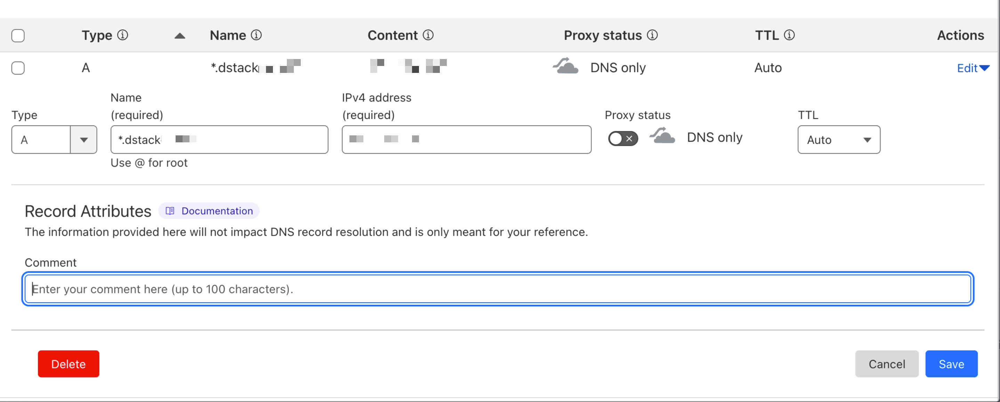

# Setup dstack-gateway for Production

To set up dstack-gateway for production, you need a wildcard domain and SSL certificate.

## Step 1: Setup wildcard domain

Set up a second-level wildcard domain using Cloudflare; make sure to disable proxy mode and use **DNS Only**.



## Step 2: Request a Wildcard Domain SSL Certificate with Certbot

You need to get a Cloudflare API Key and ensure the API can manage this domain.

You can check your Cloudflare API key and get `cf_zone_id` using this command:

```shell
curl -X GET "https://api.cloudflare.com/client/v4/zones" -H "Authorization: Bearer <API_KEY>" -H "Content-Type: application/json" | jq .
```

Open your `certbot.toml`, and update these fields:

- `acme_url`: change to `https://acme-v02.api.letsencrypt.org/directory`
- `cf_api_token`: Obtain from Cloudflare
- `cf_zone_id`: Obtain from the API call above

## Step 3: Run Certbot Manually and Get First SSL Certificates

```shell
./certbot set-caa
./certbot renew
```

## Step 4: Update `gateway.toml`

Focus on these five fields in the `core.proxy` section:

- `cert_chain` & `cert_key`: Point to the certificate paths from the previous step
- `base_domain`: The wildcard domain for proxy
- `listen_addr` & `listen_port`: Listen to `0.0.0.0` and preferably `443` in production. If using another port, specify it in the URL

For example, if your base domain is `gateway.example.com`, app ID is `<app_id>`, listening on `80`, and dstack-gateway is on port 7777, the URL would be `https://<app_id>-80.gateway.example.com:7777`

## Step 5: Adjust Configuration in `vmm.toml`

Open `vmm.toml` and adjust dstack-gateway configuration in the `gateway` section:

- `base_domain`: Same as `base_domain` from `gateway.toml`'s `core.proxy` section
- `port`: Same as `listen_port` from `gateway.toml`'s `core.proxy` section