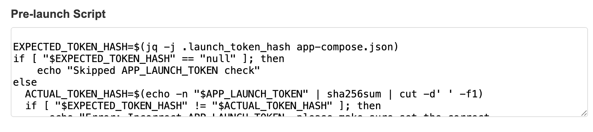
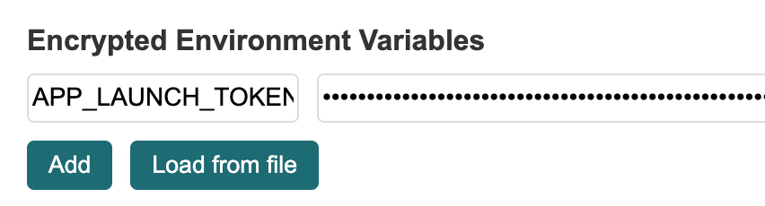

# Dstack Production Security Best Practices

This document describes security considerations for deploying dstack apps in production.

## Always pin image hash in your docker-compose.yaml

When deploying applications in a TEE environment, it's critical to ensure the integrity and immutability of your container images. Using image digests (SHA256 hashes) instead of tags cryptographically ensures that the exact same image is always pulled, preventing supply chain attacks. This proves to users that your App is anchored to a specific code version.

❌ Bad example:

```yaml
services:
  nginx:
    image: nginx:latest
```

```yaml
services:
  nginx:
    image: nginx:1.27.5
```

✅ Good example:

```yaml
services:
  nginx:
    image: nginx@sha256:eee5eae48e79b2e75178328c7c585b89d676eaae616f03f9a1813aaed820745a
```

## Reproducibility

If your App is intended for end users who need to verify what code your App is running, then the verifiability of Docker images is crucial. Dstack anchors the code running inside the CVM through the hash of app-compose.json. However, at the same time, the App needs to provide users with a reproducible build method. There are multiple ways to achieve reproducible image builds, and dstack provides a reference example: [dstack-ingress](https://github.com/Dstack-TEE/dstack-examples/tree/main/custom-domain/dstack-ingress)

## Authenticated envs and user_config

Dstack provides encrypted environment variable functionality. Although the CVM physical machine controller cannot view encrypted environment variables, they may forge encrypted environment variables because the CVM encryption public key is known to everyone. Therefore, Apps need to perform auth checks on encrypted environment variables at the application layer. LAUNCH_TOKEN pattern is one method to prevent unauthorized envs replacement. For details, refer to the deployment script of [dstack-gateway](https://github.com/Dstack-TEE/dstack/blob/1b8a4516826b02f9d7f747eddac244dcd68fc325/gateway/dstack-app/deploy-to-vmm.sh#L150-L165).

If you use dstack-vmm's built-in UI, the prelaunch script has already been automatically filled in for you:



You only need to add the `APP_LAUNCH_TOKEN` environment variable to enable LAUNCH_TOKEN checking.



user_config is not encrypted, and similarly requires integrity checks at the application layer. For example, you can store a USER_CONFIG_HASH in encrypted environment variables and verify it in the prelaunch script.

## Don't put secrets in docker-compose.yaml

CVM needs to ensure verifiability, so app-compose.json is public by default, containing the prelaunch script and docker-compose.yaml.
You should not put secrets in docker-compose.yaml for best security practice. Use encrypted environment variables instead.

In case by any chance you really do not want to expose your compose file, you can disable exposing app-compose.json by setting public_tcbinfo=false in app-compose.json.
Example app-compose.json:

```json
{
    ...
    "public_tcbinfo": false
    ...
}
```

**But keep in mind, even if you disable exposing app-compose.json, it is just hidden from the public API, the physical machine controller can still access it on the file system.**

## docker logs is public available by default

Similarly, to facilitate App observability, docker logs are public by default. You can disable exposing docker logs by setting public_logs=false.
Example app-compose.json:

```json
{
    ...
    "public_logs": false
    ...
}
```

## Don't expose unexpected ports

In Dstack CVM, dstack-guest-agent listens on port 8090, allowing public access to basic CVM information.

In docker-compose.yaml, all declared ports will be exposed to the public internet. Do not expose unnecessary ports.

For example:

```yaml
# This will expose port 80 to the public
services:
  nginx:
    image: nginx@sha256:eee5eae48e79b2e75178328c7c585b89d676eaae616f03f9a1813aaed820745a
    ports:
      - "80:80"
```

```yaml
# This will not expose port 80 to the public
services:
  nginx:
    image: nginx@sha256:eee5eae48e79b2e75178328c7c585b89d676eaae616f03f9a1813aaed820745a
```

```yaml
# This will not expose port 80 to the public
services:
  nginx:
    image: nginx@sha256:eee5eae48e79b2e75178328c7c585b89d676eaae616f03f9a1813aaed820745a
    ports:
      - "127.0.0.1:80:80"
```

Note that when setting network_mode: host, all ports listened to within the container will be exposed to the public internet.

```yaml
# This will expose port 80 to the public
services:
  nginx:
    image: nginx@sha256:eee5eae48e79b2e75178328c7c585b89d676eaae616f03f9a1813aaed820745a
    network_mode: host
```
